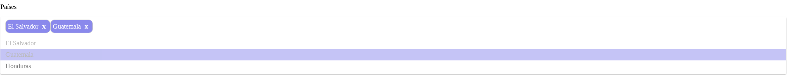

# hjs-multiselect

It's a multiselect `vue.js` component.



####  Warning!

This is an example of how to create and publish a npm package and it was created for learning purposes and as an example for horchata js conference, **DON'T USE IT ON PRODUCTION**


## Install

**npm:**

```
  npm install @horchatajs/hjs-multiselect --save
```


**yarn:**

```
  yarn add @horchatajs/hjs-multiselect
```

## Usage

### HTML

```html
<div id="app">
  <p><label for="">Países</label></p>
  <hjs-multiselect placeholder="Please select countries" v-bind:items="items" v-bind:select="select"  @change="onChange"></hjs-multiselect>
</div>
<div id="preview"></div>
```

### Javascript

```javascript

Vue.use(HjsMultiselect); // Register the global UI component

new Vue({
  el: '#app',
  data: {

    select: [{ text: 'El Salvador', value: 'SV' }],
    items: [
      {text: "El Salvador", value: "SV"},
      {text: "Guatemala", value: "GT"},
      {text: "Honduras", value: "HN"}
    ]
  },
  methods: {
    onChange: function(item, items){
      let preview = document.getElementById('preview');
      preview.innerHTML = "<p>On change event, preview of selected items: "+JSON.stringify(items)+ "</p>"
    }
  }
})
```

## Contributors

* [@emilioforrer](https://github.com/emilioforrer)
* [@ricardoerl](https://github.com/ricardoerl)
